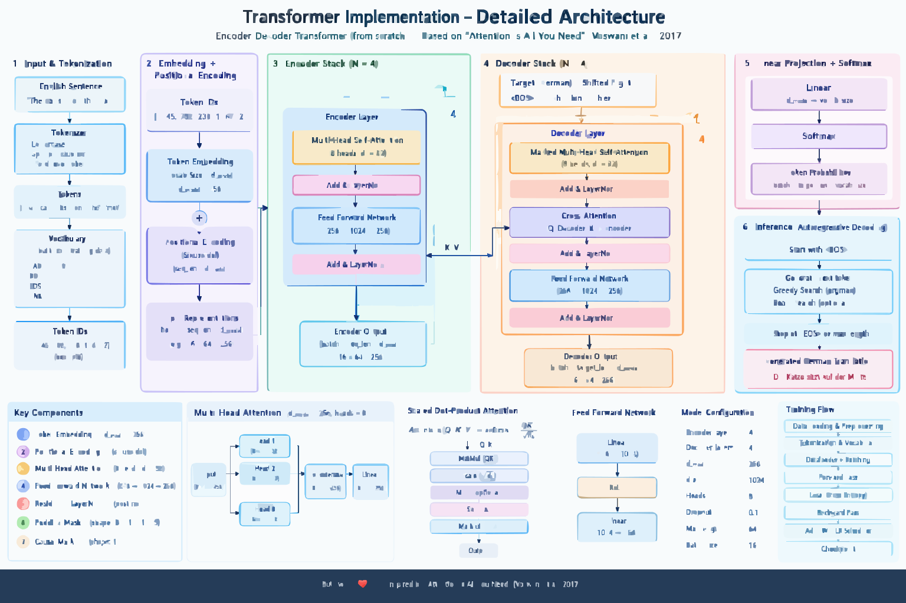

# Transformer From Scratch

A complete implementation of the **Transformer encoder-decoder architecture from scratch in PyTorch**, based on the paper:

> **Attention Is All You Need**  
> Vaswani et al., 2017

This project implements the core Transformer architecture without using PyTorch's built-in `nn.Transformer` or pretrained Transformer models.

The model is trained for **English → German neural machine translation** using the **OPUS Books** dataset.

---

## Table of Contents

- [Overview](#overview)
- [Motivation](#motivation)
- [Key Features](#key-features)
- [Architecture](#architecture)
  - [Complete Transformer Pipeline](#complete-transformer-pipeline)
  - [Encoder](#encoder)
  - [Decoder](#decoder)
  - [Multi-Head Attention](#multi-head-attention)
  - [Scaled Dot-Product Attention](#scaled-dot-product-attention)
  - [Positional Encoding](#positional-encoding)
  - [Feed-Forward Network](#feed-forward-network)
  - [Residual Connections and Layer Normalization](#residual-connections-and-layer-normalization)
  - [Masking](#masking)
- [Training Data](#training-data)
- [Tokenization](#tokenization)
- [Training Pipeline](#training-pipeline)
- [Inference](#inference)
- [Project Structure](#project-structure)
- [Model Configuration](#model-configuration)
- [Experiments](#experiments)
- [Testing](#testing)
- [Installation](#installation)
- [Usage](#usage)
- [Results](#results)
- [Limitations](#limitations)
- [Future Improvements](#future-improvements)
- [References](#references)

---

# Overview

The Transformer was introduced in the 2017 paper **"Attention Is All You Need"** as an encoder-decoder architecture based entirely on attention mechanisms, removing the recurrence used by traditional sequence-to-sequence architectures.

This project recreates the core architecture from first principles using PyTorch primitives.

The goal is not to build a production-grade translation model, but to understand and implement the complete Transformer pipeline:

```text
Text
  ↓
Tokenization
  ↓
Vocabulary
  ↓
Token IDs
  ↓
Token Embeddings
  ↓
Positional Encoding
  ↓
Transformer Encoder
  ↓
Encoder Representations
  ↓
Transformer Decoder
  ↓
Linear Projection
  ↓
Token Probabilities
  ↓
Generated German Translation
```

---

# Motivation

Modern large language models are built on Transformer-based architectures.

Instead of directly using a pretrained Transformer implementation, this project focuses on understanding what happens inside the model.

The implementation covers:

- Token embeddings
- Positional encoding
- Scaled dot-product attention
- Multi-head attention
- Encoder blocks
- Decoder blocks
- Cross-attention
- Feed-forward networks
- Residual connections
- Layer normalization
- Padding masks
- Causal masks
- Autoregressive decoding
- Training and validation
- Checkpointing
- Gradient clipping
- AdamW optimization
- Learning-rate scheduling
- Teacher-forced evaluation

---

# Key Features

### Architecture

- Encoder-decoder Transformer
- Multi-head self-attention
- Masked decoder self-attention
- Encoder-decoder cross-attention
- Position-wise feed-forward networks
- Sinusoidal positional encoding
- Residual connections
- Layer normalization
- Dropout

### Training

- PyTorch training loop
- AdamW optimizer
- Noam-style learning-rate scheduling
- Gradient clipping
- Padding-aware cross-entropy loss
- Label smoothing experiments
- Model checkpointing
- GPU training
- Validation loop

### Inference

- Autoregressive decoding
- Greedy decoding
- Beam-search implementation
- End-of-sequence stopping
- Attention map collection

### Engineering

- Modular project structure
- Configuration dataclass
- Separate model components
- Dataset preprocessing
- Vocabulary construction
- Unit-style tests
- Reproducible training configuration

---

# Architecture

The architecture is based on the original Transformer proposed by Vaswani et al.

The original Transformer uses an encoder-decoder structure:

```text
                    ┌─────────────────────┐
                    │    Source Tokens    │
                    │   English Sentence  │
                    └──────────┬──────────┘
                               │
                               ▼
                    ┌─────────────────────┐
                    │  Token Embedding    │
                    └──────────┬──────────┘
                               │
                               ▼
                    ┌─────────────────────┐
                    │ Positional Encoding │
                    └──────────┬──────────┘
                               │
                               ▼
                  ┌──────────────────────────┐
                  │      ENCODER STACK       │
                  │                          │
                  │ Multi-Head Self-Attn     │
                  │          ↓               │
                  │ Add + LayerNorm          │
                  │          ↓               │
                  │ Feed Forward             │
                  │          ↓               │
                  │ Add + LayerNorm          │
                  │                          │
                  │        × 4 layers        │
                  └────────────┬─────────────┘
                               │
                         Encoder Memory
                               │
                    ┌──────────┴──────────┐
                    │                     │
                    ▼                     ▼
             Keys / Values          Decoder Input
                                          │
                                          ▼
                               ┌─────────────────────┐
                               │  Target Embedding   │
                               └──────────┬──────────┘
                                          │
                                          ▼
                               ┌─────────────────────┐
                               │ Positional Encoding │
                               └──────────┬──────────┘
                                          │
                                          ▼
                         ┌────────────────────────────┐
                         │       DECODER STACK        │
                         │                            │
                         │ Masked Self-Attention      │
                         │           ↓                │
                         │ Add + LayerNorm            │
                         │           ↓                │
                         │ Cross-Attention            │◄──── Encoder Memory
                         │           ↓                │
                         │ Add + LayerNorm            │
                         │           ↓                │
                         │ Feed Forward               │
                         │           ↓                │
                         │ Add + LayerNorm            │
                         │                            │
                         │         × 4 layers        │
                         └────────────┬───────────────┘
                                      │
                                      ▼
                             ┌────────────────┐
                             │ Linear Layer   │
                             └───────┬────────┘
                                     │
                                     ▼
                                Softmax
                                     │
                                     ▼
                              Next Token
                                     │
                                     └──────► autoregressive loop
```

The original paper uses six encoder and six decoder layers in its base Transformer configuration. This project uses a smaller configuration of **4 encoder layers and 4 decoder layers** to make training feasible on a consumer GPU.


---

# Complete Transformer Pipeline

## 1. Source Tokenization

An English sentence is first converted into tokens.

Example:

```text
Input:
What does Bessie say?

Tokens:
["what", "does", "bessie", "say", "?"]
```

Special tokens are used:

```text
PAD = 0
BOS = 1
EOS = 2
UNK = 3
```

---

## 2. Vocabulary

Each token is mapped to an integer ID.

Example:

```text
"what"   → 421
"does"   → 827
"bessie" → 1934
"say"    → 512
"?"      → 17
```

The resulting sequence becomes:

```text
[BOS, 421, 827, 1934, 512, 17, EOS]
```

The same process is applied independently to German.

---

# Token Embeddings

Token IDs themselves do not contain semantic information.

The embedding layer converts each token ID into a continuous vector:

```text
Token ID
   │
   ▼
Embedding Matrix
   │
   ▼
d_model-dimensional vector
```

This implementation scales the embeddings by:

```text
sqrt(d_model)
```

following the Transformer formulation.

For this project:

```text
d_model = 256
```

Therefore each token is represented by a 256-dimensional vector.

---

# Positional Encoding

Self-attention does not inherently know the order of tokens.

For example:

```text
"I love machine learning"

and

"machine learning love I"
```

would contain the same tokens but have different meanings.

Therefore positional information is added to token embeddings.

This implementation uses the original sinusoidal positional encoding:

```text
PE(pos, 2i)   = sin(pos / 10000^(2i/d_model))

PE(pos, 2i+1) = cos(pos / 10000^(2i/d_model))
```

The positional encoding is added to the token embeddings:

```text
Input Representation =
Token Embedding + Positional Encoding
```

---

# Encoder

The encoder transforms the source sentence into contextual representations.

Each encoder layer contains:

```text
Input
  │
  ▼
Multi-Head Self-Attention
  │
  ▼
Dropout
  │
  ▼
Residual Connection
  │
  ▼
Layer Normalization
  │
  ▼
Feed-Forward Network
  │
  ▼
Dropout
  │
  ▼
Residual Connection
  │
  ▼
Layer Normalization
```

This project stacks:

```text
4 Encoder Layers
```

The final encoder output is commonly referred to as the encoder memory.

---

# Multi-Head Attention

The core operation of the Transformer is attention.

The basic attention function is:

```text
Attention(Q, K, V)
=
softmax(QKᵀ / √d_k)V
```

Where:

```text
Q = Queries
K = Keys
V = Values
d_k = dimension of each attention head
```

The attention mechanism allows every token to determine which other tokens are relevant when constructing its contextual representation.

---

# Scaled Dot-Product Attention

The implementation performs the following steps:

### Step 1 — Query-Key similarity

```text
Scores = QKᵀ
```

### Step 2 — Scaling

```text
Scores = Scores / √d_k
```

### Step 3 — Apply mask

Invalid positions are replaced with a large negative value.

```text
Masked Scores
```

### Step 4 — Softmax

```text
Attention Weights = softmax(Scores)
```

### Step 5 — Weighted sum

```text
Output = Attention Weights × V
```

---

# Multi-Head Attention

Instead of performing one attention operation, the Transformer performs several attention operations in parallel.

For this project:

```text
d_model = 256
num_heads = 8
```

Therefore:

```text
d_k = 256 / 8
    = 32
```

The process is:

```text
Input
  │
  ├──► Q Projection ──► Head 1
  ├──► K Projection ──► Head 1
  └──► V Projection ──► Head 1

  ├──► Q Projection ──► Head 2
  ├──► K Projection ──► Head 2
  └──► V Projection ──► Head 2

              ...

  ├──► Q Projection ──► Head 8
  ├──► K Projection ──► Head 8
  └──► V Projection ──► Head 8

              ↓

       Concatenate Heads

              ↓

       Output Projection
```

Different heads can learn different relationships between tokens.

---

# Encoder Self-Attention

In the encoder:

```text
Q = Encoder Input
K = Encoder Input
V = Encoder Input
```

Therefore:

```text
Self-Attention(Q, K, V)
```

allows every source token to attend to other source tokens.

For example:

```text
"The animal didn't cross the road because it was tired."
```

The representation of `it` can attend to other relevant words in the sentence.

---

# Decoder

The decoder generates the target sentence autoregressively.

Each decoder layer contains three sub-layers:

```text
1. Masked Multi-Head Self-Attention

2. Encoder-Decoder Cross-Attention

3. Feed-Forward Network
```

with residual connections and layer normalization around each sub-layer.

The complete decoder flow is:

```text
Target Tokens
     │
     ▼
Target Embedding
     │
     ▼
Positional Encoding
     │
     ▼
Masked Self-Attention
     │
     ▼
Add + LayerNorm
     │
     ▼
Cross-Attention
     │
     │ ◄──── Encoder Output
     ▼
Add + LayerNorm
     │
     ▼
Feed Forward
     │
     ▼
Add + LayerNorm
```

This project uses:

```text
4 Decoder Layers
```

---

# Masked Self-Attention

During training, the decoder must not see future target tokens.

For example, when predicting:

```text
Ich
```

it can see:

```text
<BOS>
```

but not:

```text
komme morgen nach Hause
```

A causal mask creates a lower-triangular attention matrix:

```text
1 0 0 0
1 1 0 0
1 1 1 0
1 1 1 1
```

This prevents information from future positions from leaking into the current prediction.

---

# Cross-Attention

Cross-attention connects the encoder and decoder.

Here:

```text
Q = Decoder representation

K = Encoder output

V = Encoder output
```

Therefore the decoder can ask:

> "Which parts of the source sentence are relevant for generating the next target token?"

Conceptually:

```text
             Encoder
                │
                │ K, V
                ▼
          ┌─────────────┐
          │ Cross       │
Decoder ─►│ Attention   │
    Q     └─────────────┘
                │
                ▼
       Contextual Decoder
          Representation
```

This is the mechanism that allows the model to align source and target information.

---

# Feed-Forward Network

Each encoder and decoder block contains a position-wise feed-forward network.

The implementation uses:

```text
Linear(d_model → d_ff)
        ↓
      ReLU
        ↓
Linear(d_ff → d_model)
```

For this project:

```text
d_model = 256
d_ff    = 1024
```

Therefore:

```text
256 → 1024 → 256
```

The same transformation is independently applied to each sequence position.

---

# Residual Connections and Layer Normalization

Each Transformer sub-layer is wrapped with a residual connection and LayerNorm.

Conceptually:

```text
              ┌──────────────────────┐
              │                      │
Input ────────┼────► Sub-layer ──────┼──► Add ──► LayerNorm
              │                      │
              └──────────────────────┘
```

The project follows the **post-normalization formulation** corresponding to the original paper:

```text
LayerNorm(x + Sublayer(x))
```

Residual connections help preserve information and make deep Transformer stacks easier to optimize.

---

# Decoder Output

After the final decoder layer:

```text
Decoder Representation
        │
        ▼
Linear Projection
        │
        ▼
Target Vocabulary Logits
        │
        ▼
Softmax
        │
        ▼
Probability Distribution
```

For every decoder position, the model produces a probability distribution over the entire German vocabulary.

---

# Weight Tying

The target embedding matrix and final output projection share weights:

```text
Target Embedding
       │
       │ shared weights
       ▼
Output Projection
```

This reduces the number of independent parameters and follows the weight-sharing idea used in the Transformer literature.

Because English and German use separate vocabularies in this implementation, source and target embeddings are not shared.

---

# Training

Training uses teacher forcing.

Suppose the target sentence is:

```text
<BOS> ich bin hier <EOS>
```

The decoder receives:

```text
<BOS> ich bin hier
```

and learns to predict:

```text
ich bin hier <EOS>
```

Therefore:

```text
Decoder Input:
[BOS, ich, bin, hier]

Expected Output:
[ich, bin, hier, EOS]
```

This is implemented through target shifting.

---

# Loss Function

The project uses token-level cross entropy while ignoring padding tokens.

Conceptually:

```text
Loss =
CrossEntropy(predicted_tokens, target_tokens)
```

Padding tokens are excluded from the loss:

```text
ignore_index = PAD
```

Label smoothing was also experimented with during training.

---

# Optimizer

The model uses:

```text
AdamW
```

with:

```text
β1 = 0.9
β2 = 0.98
ε  = 1e-9
```

Weight decay is configurable.

---

# Learning Rate Scheduling

The project includes an implementation of the Transformer-style Noam learning-rate schedule.

The schedule follows the form:

```text
lr ∝ d_model^(-0.5)
     × min(
          step^(-0.5),
          step × warmup_steps^(-1.5)
       )
```

The purpose of the warmup phase is to gradually increase the learning rate before entering the inverse-square-root decay regime.

---

# Gradient Clipping

Gradient clipping is applied to prevent excessively large gradients:

```text
max_norm = 1.0
```

This is particularly useful when training the model from scratch.

---

# Dataset

The project uses the:

**OPUS Books English-German dataset**

The dataset is loaded through the Hugging Face `datasets` library.

The current experiment uses:

```text
Raw selected samples:      10,000
Final usable pairs:         9,050

Training samples:           8,145
Validation samples:           905
```

The preprocessing pipeline removes:

- Metadata lines
- Empty examples
- Excessively long sequences
- Extreme source/target length ratios
- Exact duplicate translation pairs

The current maximum sequence length is:

```text
64 tokens
```

---

# Tokenization

This project intentionally uses a simple word-level tokenizer rather than a pretrained tokenizer.

The tokenizer:

- converts text to lowercase
- normalizes whitespace
- separates punctuation
- separates quotation marks
- produces token sequences

Example:

```text
English:

What does Bessie say?

↓

["what", "does", "bessie", "say", "?"]
```

The vocabulary is built from the training data.

Current vocabulary sizes:

```text
Source vocabulary: 10,897
Target vocabulary: 15,846
```

Special tokens:

```text
PAD = 0
BOS = 1
EOS = 2
UNK = 3
```

---

# Model Configuration

The current training configuration is intentionally smaller than the original Transformer Base configuration.

| Parameter | This Project | Original Transformer Base |
|---|---:|---:|
| Encoder layers | 4 | 6 |
| Decoder layers | 4 | 6 |
| `d_model` | 256 | 512 |
| Attention heads | 8 | 8 |
| `d_ff` | 1024 | 2048 |
| Dropout | 0.1 | 0.1 |
| Max sequence length | 64 | — |
| Batch size | 16 | — |

The smaller configuration makes experimentation practical on a consumer GPU.

---

# Model Size

Current model:

```text
Parameters: 14,220,032
```

Hardware used for training:

```text
GPU: NVIDIA GeForce RTX 3060 Laptop GPU
VRAM: 6 GB
CUDA: 12.6
PyTorch: 2.14.0+cu126
```

---

# Training Pipeline

The complete training pipeline is:

```text
OPUS Books
    │
    ▼
Dataset Cleaning
    │
    ▼
Train / Validation Split
    │
    ▼
Tokenization
    │
    ▼
Vocabulary Construction
    │
    ▼
Token IDs
    │
    ▼
Padding + Batching
    │
    ▼
Target Shifting
    │
    ▼
Transformer Forward Pass
    │
    ├── Encoder
    │
    └── Decoder
    │
    ▼
Vocabulary Logits
    │
    ▼
Cross-Entropy Loss
    │
    ▼
Backpropagation
    │
    ▼
Gradient Clipping
    │
    ▼
AdamW
    │
    ▼
Checkpoint
```

---

# Inference

Inference uses autoregressive decoding.

The process starts with:

```text
<BOS>
```

The model predicts one token at a time.

Example:

```text
<BOS>
   ↓
ich
   ↓
ich bin
   ↓
ich bin hier
   ↓
ich bin hier <EOS>
```

The generated sequence stops when:

```text
EOS
```

is produced or the maximum sequence length is reached.

---

# Greedy Decoding

The current greedy decoder selects:

```text
argmax(P(next_token | previous_tokens, source))
```

at every generation step.

This is simple and deterministic, but it does not always produce the globally best sequence.

A beam-search implementation is also included for experimentation.

---

# Project Structure

```text
transformer-from-scratch/
│
├── configs/
│   ├── __init__.py
│   └── config.py
│
├── data/
│   ├── download.py
│   ├── preprocess.py
│   ├── dataset.py
│   └── collate.py
│
├── tokenizer/
│   ├── tokenizer.py
│   └── vocab.py
│
├── model/
│   ├── __init__.py
│   ├── embeddings.py
│   ├── positional_encoding.py
│   ├── attention.py
│   ├── feed_forward.py
│   ├── encoder.py
│   ├── decoder.py
│   ├── masks.py
│   └── transformer.py
│
├── training/
│   ├── trainer.py
│   ├── optimizer.py
│   ├── scheduler.py
│   ├── losses.py
│   ├── batch_utils.py
│   ├── checkpoint.py
│   └── amp.py
│
├── inference/
│   ├── __init__.py
│   ├── greedy.py
│   ├── beam_search.py
│   └── translate.py
│
├── evaluation/
│   └── metrics.py
│
├── Test/
│   ├── __init__.py
│   ├── test_attention.py
│   ├── test_encoder.py
│   ├── test_decoder.py
│   ├── test_masks.py
│   ├── test_transformer.py
│   └── test_teacher_forcing.py
│
├── train.py
├── requirements.txt
├── README.md
└── .gitignore
```

---

# Implementation Details

## Attention

Implemented manually using PyTorch tensor operations:

```text
Q = Linear(query)
K = Linear(key)
V = Linear(value)

scores = QKᵀ / sqrt(d_k)

attention_weights = softmax(scores)

context = attention_weights × V
```

No built-in Transformer attention module is used.

---

## Masks

Three important masks are implemented.

### Source Padding Mask

Prevents the encoder from attending to padding tokens.

Shape:

```text
[B, 1, 1, S]
```

### Causal Mask

Prevents the decoder from attending to future tokens.

Shape:

```text
[1, 1, T, T]
```

### Decoder Mask

Combines:

```text
Padding Mask
      AND
Causal Mask
```

Shape:

```text
[B, 1, T, T]
```

---

# Testing

The project includes component-level tests.

Run from the project root:

```bash
python -m Test.test_attention
python -m Test.test_encoder
python -m Test.test_decoder
python -m Test.test_masks
python -m Test.test_transformer
python -m Test.test_teacher_forcing
```

The tests verify different parts of the architecture including:

- Attention dimensions
- Encoder forward pass
- Decoder forward pass
- Mask shapes and behavior
- Complete Transformer forward pass
- Teacher-forced predictions

---

# Installation

Clone the repository:

```bash
git clone <YOUR_REPOSITORY_URL>
cd transformer-from-scratch
```

Create a virtual environment:

```bash
python -m venv .venv
```

Activate it on Windows:

```powershell
.venv\Scripts\Activate.ps1
```

Install dependencies:

```bash
pip install -r requirements.txt
```

Verify PyTorch and CUDA:

```bash
python -c "import torch; print(torch.__version__); print(torch.cuda.is_available())"
```

---

# Training

Start training with:

```bash
python train.py
```

The training script:

1. Downloads the dataset
2. Cleans the translation pairs
3. Builds source and target vocabularies
4. Creates dataloaders
5. Builds the Transformer
6. Trains the model
7. Evaluates validation loss
8. Saves checkpoints

Checkpoints are saved under:

```text
checkpoints/
```

These files should not be committed to GitHub.

---

# Translation

Run the translation script as a module:

```bash
python -m inference.translate
```

The inference pipeline loads the trained checkpoint and reconstructs the vocabulary using the same preprocessing configuration used during training.

---

# Experiments

Several experiments were performed during development.

## 1. One-Sample Overfitting

A single clean training example was used to verify whether the model could completely memorize a translation pair.

Result:

```text
Token accuracy: ~100%
Loss: approximately 0
```

This verified that the complete forward and backward paths were functional.

---

## 2. Ten-Sample Overfitting

The model was trained on a very small dataset.

Result:

```text
Training loss → approximately 0
Token accuracy → approximately 100%
```

This experiment demonstrated that the architecture can memorize a small translation dataset.

---

## 3. Full Dataset Training

Current configuration:

```text
Training examples: 8,145
Validation examples: 905

d_model: 256
Heads: 8
Encoder layers: 4
Decoder layers: 4
d_ff: 1024
Batch size: 16
Max length: 64
```

Best observed validation loss:

```text
5.4714
```

The best checkpoint occurred around epoch 12 in the latest experiment.

---

# Current Results

The model successfully trains end-to-end and learns meaningful token-level relationships.

However, the current model should **not** be considered a production-quality English-German translation system.

One teacher-forcing evaluation produced:

```text
Token Accuracy: 39.13%
Correct Tokens: 9 / 23
```

The model also shows repetitive or semantically incorrect outputs during greedy decoding.

This is an intentional limitation of the current experiment and highlights an important lesson:

> Successfully implementing and training a Transformer does not automatically produce a high-quality translation model.

The current project prioritizes understanding the architecture and training pipeline over achieving state-of-the-art translation quality.

---

# What Was Implemented From Scratch?

The following components were implemented directly in this project:

```text
✓ Token Embedding
✓ Sinusoidal Positional Encoding
✓ Scaled Dot-Product Attention
✓ Multi-Head Attention
✓ Encoder Layer
✓ Encoder Stack
✓ Decoder Layer
✓ Decoder Stack
✓ Masked Self-Attention
✓ Encoder-Decoder Cross-Attention
✓ Feed-Forward Network
✓ Residual Connections
✓ Layer Normalization
✓ Padding Masks
✓ Causal Masks
✓ Transformer Model
✓ Training Loop
✓ Validation Loop
✓ AdamW Optimizer
✓ Noam Learning Rate Scheduler
✓ Gradient Clipping
✓ Checkpointing
✓ Greedy Decoding
✓ Beam Search
✓ Teacher-Forced Evaluation
```

---

# What Was NOT Used?

This project intentionally does not use:

```text
✗ torch.nn.Transformer
✗ torch.nn.TransformerEncoder
✗ torch.nn.TransformerDecoder
✗ Hugging Face pretrained Transformer models
✗ Pretrained translation models
```

PyTorch is used for tensor operations, neural-network primitives, optimization, GPU acceleration, and automatic differentiation.

---

# Limitations

The current implementation has several limitations.

### 1. Small Training Dataset

Only approximately 9,050 usable translation pairs were selected for the current experiment.

A larger dataset would provide significantly more linguistic diversity.

### 2. Word-Level Vocabulary

The current implementation uses a basic word-level tokenizer.

This produces relatively large vocabularies:

```text
English vocabulary: 10,897
German vocabulary: 15,846
```

Rare words and morphological variations are therefore difficult to model efficiently.

### 3. Dataset Noise

Some OPUS Books examples contain noisy or imperfect sentence alignment.

### 4. Limited Compute

The model was trained on a 6 GB RTX 3060 Laptop GPU.

This limits:

- model size
- batch size
- sequence length
- training dataset size
- number of training experiments

### 5. Greedy Decoding

Greedy decoding can produce repetitive or suboptimal sequences.

### 6. Limited Training

The current experiment is primarily intended as an educational implementation rather than a fully optimized translation system.

---

# Future Improvements

Potential future improvements include:

- Subword tokenization using BPE or SentencePiece
- Larger training dataset
- Better dataset alignment
- Larger Transformer configuration
- Longer training
- Learning-rate experiments
- Beam-search optimization
- BLEU evaluation
- Attention visualization
- TensorBoard/W&B experiment tracking
- Mixed precision training
- Dynamic batching
- Label-smoothing optimization
- Better checkpoint management
- Distributed training
- Translation quality benchmarking

---

# Why Build a Transformer From Scratch?

Using a pretrained Transformer is convenient.

Implementing one from scratch is different.

This project was built to understand:

```text
What actually happens between:

Input tokens

      ↓

Embeddings

      ↓

Attention

      ↓

Encoder

      ↓

Cross-Attention

      ↓

Decoder

      ↓

Logits

      ↓

Generated tokens
```

Understanding these components provides a stronger foundation for working with modern architectures such as:

- BERT
- GPT
- T5
- LLaMA
- Mistral
- modern multimodal Transformers
- Retrieval-Augmented Generation systems
- Agentic LLM systems

---

# Architecture Reference

The implementation is primarily based on the original:

**Vaswani et al. — Attention Is All You Need (2017)**

The original paper introduced the Transformer architecture and described scaled dot-product attention, multi-head attention, positional encoding, encoder-decoder stacks, masking, residual connections and layer normalization.

---

# References

1. Vaswani, A. et al. (2017).  
   **Attention Is All You Need.**  
   Advances in Neural Information Processing Systems.

2. Rush, A. et al.  
   **The Annotated Transformer.**  
   Harvard NLP.

3. OPUS Books Dataset  
   English-German parallel corpus.

---

# Acknowledgements

This implementation was developed as an educational project to understand the Transformer architecture at the implementation level.

The architectural design is based on the work presented in:

> Vaswani et al., **Attention Is All You Need**, 2017.

---

# Author

**Kumar Yash**

Computer Science Engineering Student

Interested in:

- Machine Learning
- Generative AI
- LLMs
- AI Engineering
- Deep Learning
- NLP

---

## Project Goal

> **Understand the Transformer by implementing it, not just by importing it.**